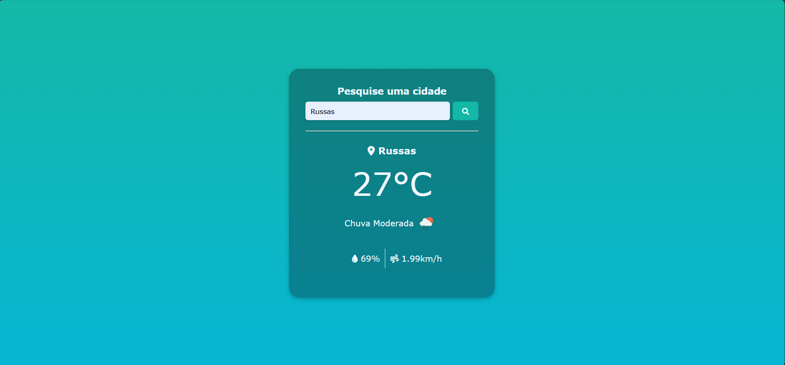

# Estudo de api

Trabalho da disciplina de Web

## Projeto

A ideia consiste em fazer uma pesquisa pela cidade, requisitar em uma api (Open Weather Map) e mostrar algumas informações

Aqui temos alguns exemplos:

Página inicial  

Exemplo de pesquisa  

